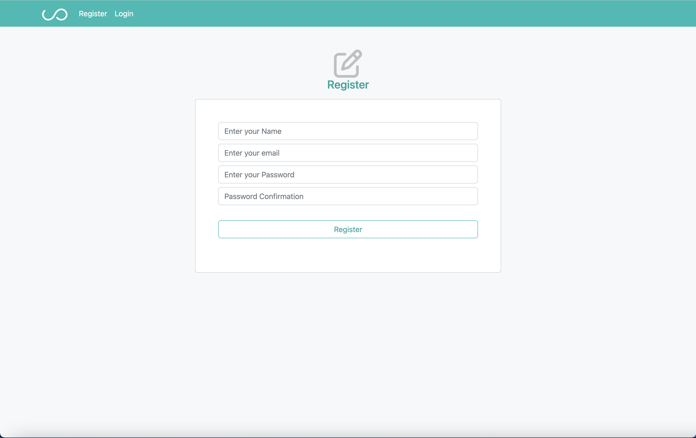
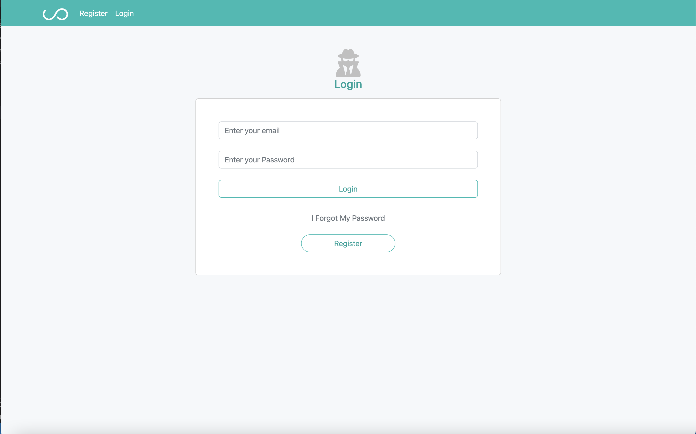
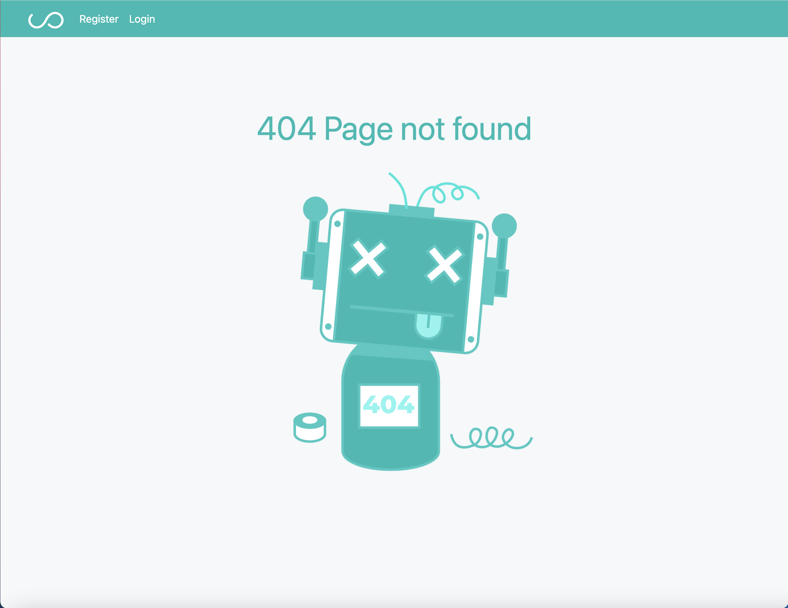

# Getting Started with Create React App

This project was bootstrapped with [Create React App](https://github.com/facebook/create-react-app).

## Available Scripts

In the project directory, you can run:

### `npm start`

Runs the app in the development mode.\
Open [http://localhost:3000](http://localhost:3000) to view it in your browser.

The page will reload when you make changes.\
You may also see any lint errors in the console.

# npm i axios

Requests can be made by passing the relevant config to axios.

# npm i react-router-dom

we used it for React Router in web applications

# npm i lottie-react

we add this pages in order to add animation
example in the notfound screen

in this part of the project we build three screens .

1-The Register screen

2-The Login screen

1-The NotFound screen

